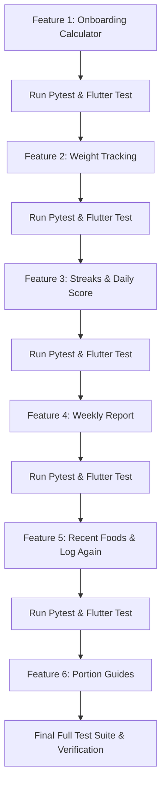

# Heathify: 6-Feature Implementation Plan

This document outlines the detailed architectural and implementation plan for building the 6 required features in **Heathify** (FastAPI backend + Flutter mobile frontend).

Each feature will be implemented, tested, and validated sequentially according to the project conventions.

---

## Technical Stack & Architectural Conventions

- **Backend**:
  - FastAPI (Python 3.12), Async SQLAlchemy 2.0, Alembic migrations (`0008`, `0009`, ...), Pydantic v2.
  - In-memory SQLite with `StaticPool` and `aiosqlite` for `pytest` in `backend/tests/conftest.py`.
  - All routes mounted under `/api/v1` via `backend/app/api/v1/router.py`.
  - Strict authentication: all new endpoints require `Depends(get_current_user)` from `app.core.security`.
  - Timezone convention: Client sends `tz_offset` in minutes (e.g. `+330` for IST UTC+5:30). Day boundaries are evaluated with UTC offset adjustments.
- **Frontend**:
  - Flutter 3, Provider + `ChangeNotifier` ViewModels, Repositories in `lib/data/repositories/`, Models in `lib/data/models/`, Views in `lib/ui/features/<feature>/`.
  - Centralized endpoint constants in `lib/core/config/api_constants.dart`.
  - Network calls using existing `ApiClient` (`lib/core/network/api_client.dart`) and UI styling adhering strictly to `AppTheme` (`lib/core/theme/app_theme.dart`).
  - No unnecessary external dependencies.

---

## Sequential Implementation Workflow

---

## Feature 1: Onboarding Calculator

### 1. Requirements & Formulas
- **User Profile Fields**:
  - `age`: integer (range 13–100)
  - `sex`: `'male'` | `'female'`
  - `height_cm`: float (range 100.0–250.0)
  - `weight_kg`: float (range 30.0–300.0)
  - `activity_level`: `'sedentary'` | `'light'` | `'moderate'` | `'active'` | `'very_active'`
  - `goal`: `'lose'` | `'maintain'` | `'gain'`
  - `onboarding_completed`: boolean (default `false`)
- **Mifflin-St Jeor BMR Formula**:
  - Male: $\text{BMR} = 10 \times \text{weight\_kg} + 6.25 \times \text{height\_cm} - 5 \times \text{age} + 5$
  - Female: $\text{BMR} = 10 \times \text{weight\_kg} + 6.25 \times \text{height\_cm} - 5 \times \text{age} - 161$
- **TDEE & Caloric Goal Adjustment**:
  - Activity Multipliers:
    - `sedentary`: $1.2$
    - `light`: $1.375$
    - `moderate`: $1.55$
    - `active`: $1.725$
    - `very_active`: $1.9$
  - $\text{TDEE} = \text{BMR} \times \text{Multiplier}$
  - Target Calories:
    - `lose`: $\text{TDEE} - 500\text{ kcal}$
    - `maintain`: $\text{TDEE}$
    - `gain`: $\text{TDEE} + 300\text{ kcal}$
  - **Calorie Floor Clamping**:
    - Never fall below **1,200 kcal** for female or **1,500 kcal** for male.
- **Macronutrient Split**:
  - **Protein**: $1.6\text{ g/kg}$ of body weight ($1.2\text{ g/kg}$ for `maintain`).
  - **Fat**: $25\%$ of total target calories:
    $$\text{Fat (g)} = \frac{\text{Target Calories} \times 0.25}{9}$$
  - **Carbohydrates**: Remaining calories divided by 4:
    $$\text{Carbs (g)} = \max\left(0, \frac{\text{Target Calories} - (4 \times \text{Protein (g)} + 9 \times \text{Fat (g)})}{4}\right)$$
  - **Fiber**: $14\text{ g}$ per $1,000\text{ kcal}$:
    $$\text{Fiber (g)} = \left(\frac{\text{Target Calories}}{1000.0}\right) \times 14.0$$
  - **Water**: Standard baseline $2,500\text{ ml}$ (or $\text{weight\_kg} \times 35\text{ ml}$).

### 2. Backend Design
- **Database Schema**:
  - Create table `user_profiles` with `user_id` (ForeignKey `users.id`, unique, cascade delete), `age`, `sex`, `height_cm`, `weight_kg`, `activity_level`, `goal`, `onboarding_completed`, `created_at`, `updated_at`.
  - Migration: `backend/alembic/versions/0008_add_user_profile.py`.
- **Endpoints**:
  - `POST /api/v1/users/me/profile`: Saves profile, calculates targets, writes/updates `Goal` row, returns `{ profile, goal, bmr, tdee }`.
  - `GET /api/v1/users/me/profile`: Returns current profile and calculated BMR/TDEE.
  - `POST /api/v1/users/me/profile/preview`: Calculates BMR, TDEE, and targets without persisting (for live UI feedback).
- **Validation**:
  - Pydantic models with `@field_validator` / `Annotated[Field(ge=..., le=...)]` enforcing age (13–100), height (100–250), weight (30–300), returning standard HTTP 422 Unprocessable Entity on validation failures.

### 3. Flutter Design
- **Navigation Flow**:
  - In `_RootScreen` (`lib/main.dart`): If authenticated and `onboarding_completed == false`, navigate to `OnboardingView`.
  - Also accessible from `SettingsView` as *"Recalculate targets"*.
- **3-Step Wizard (`lib/ui/features/onboarding/onboarding_view.dart`)**:
  - **Step 1**: Age and biological sex toggle (`Male` / `Female`).
  - **Step 2**: Height (cm) and Weight (kg) with responsive number inputs / sliders.
  - **Step 3**: Activity level selector and primary goal (`Lose Weight`, `Maintain`, `Build Muscle/Gain`).
  - **Step 4 (Result Preview)**: Displays BMR, TDEE, recommended calories and macros with an *"Edit targets"* modal or *"Save & Continue"* button.
- **ViewModel & Repository**:
  - `OnboardingViewModel` (`lib/ui/features/onboarding/onboarding_view_model.dart`).
  - `ProfileRepository` (`lib/data/repositories/profile_repository.dart`).

### 4. Tests
- Unit tests for Mifflin-St Jeor calculation (male 25yo 70kg 175cm, female 30yo 60kg 165cm).
- Floor clamping tests: aggressive calorie deficit asserting $\ge 1200\text{ kcal}$ (female) and $\ge 1500\text{ kcal}$ (male).
- Input validation tests: 422 status on age 10, height 50, weight 400.

---

## Feature 2: Weight Tracking

### 1. Requirements & Schema
- **Database Table `weight_logs`**:
  - `id`: UUID (Primary Key)
  - `user_id`: UUID (ForeignKey `users.id`, ondelete `CASCADE`, indexed)
  - `weight_kg`: Float (nullable=False)
  - `logged_at`: DateTime(timezone=True) (nullable=False)
  - `note`: String(255) (nullable=True)
  - `created_at`: DateTime(timezone=True)
  - Migration: `backend/alembic/versions/0009_add_weight_logs.py`.
- **Profile Synchronization**:
  - Logging a weight entry updates `user_profiles.weight_kg` with the latest logged value.

### 2. Backend Design
- **Endpoints**:
  - `POST /api/v1/weight`: Creates weight log, updates profile weight, returns logged record.
  - `GET /api/v1/weight/history?days=30&tz_offset=0`: Retrieves chronological list of weight entries, along with weight statistics:
    - `current_weight`, `start_weight`, `change_total_kg`, `change_7d_kg`.
  - `DELETE /api/v1/weight/{id}`: User-scoped deletion.
- **Schemas**: `WeightLogCreate`, `WeightLogRead`, `WeightHistoryResponse`.

### 3. Flutter Design
- **Home Screen Integration**:
  - Add *"Log Weight"* quick action card / button on `HomeView`.
- **Weight Tracking Screen (`lib/ui/features/weight/weight_view.dart`)**:
  - Stat cards: *Current Weight*, *Change this week (7d)*, *Overall Change*.
  - **Dual-Axis Chart**:
    - Weight line trend (7, 30, 90 days toggle).
    - Overlaid with daily calorie bars/trend from daily analytics.
    - Matching the clean design style of `nutrition_trends_chart.dart`.
  - History list with delete option.
- **ViewModel & Repository**:
  - `WeightViewModel` (`lib/ui/features/weight/weight_view_model.dart`).
  - `WeightRepository` (`lib/data/repositories/weight_repository.dart`).

### 4. Tests
- Endpoint tests: create weight log, verify profile weight updated, get 7/30 day history, verify stats, user-scoped delete.

---

## Feature 3: Streaks and Daily Score

### 1. Requirements & Scoring Logic
- **Daily Score Formula (0–100 Points)**:
  1. **Calories (40 Points)**:
     - Consumed calories within $\pm 10\%$ of target: **40 pts**.
     - Outside $\pm 10\%$: score scales down linearly:
       $$\text{Points} = \max\left(0, 40 \times \left(1 - \frac{|\text{consumed} - \text{target}| - 0.10 \times \text{target}}{\text{target}}\right)\right)$$
  2. **Protein (30 Points)**:
     - $\text{Protein} \ge 90\%$ of target: **30 pts**.
     - Otherwise: $30 \times (\text{consumed\_protein} / (0.9 \times \text{target\_protein}))$.
  3. **Fiber (15 Points)**:
     - $\text{Fiber} \ge 90\%$ of target: **15 pts**.
     - Otherwise proportional.
  4. **Water (15 Points)**:
     - $\text{Water} \ge 90\%$ of target: **15 pts**.
     - Otherwise proportional.
- **Logging Streak**:
  - Consecutive days with at least 1 logged meal.
  - Calculated based on `tz_offset`.
  - Calculates `current_logging_streak` and `longest_streak`.
- **Derived Badges (Zero new database tables)**:
  - `"streak_3"`: 3-Day Logging Streak
  - `"streak_7"`: 7-Day Logging Streak
  - `"streak_14"`: 14-Day Logging Streak
  - `"streak_30"`: 30-Day Logging Streak
  - `"protein_champ"`: Hit protein target today
  - `"calorie_bullseye"`: Consumed calories within $\pm 5\%$ of goal today

### 2. Backend Design
- **Endpoint**:
  - `GET /api/v1/analytics/streaks?tz_offset=0`:
    Returns `{ current_streak, longest_streak, days_logged_this_week, today_score, score_breakdown, badges }`.
- **Schemas**: `StreakAnalyticsResponse`, `DailyScoreBreakdown`, `BadgeItem`.

### 3. Flutter Design
- **Home Screen Widgets**:
  - Streak chip in app bar or top header: `🔥 5 Days`.
  - Interactive Daily Score Ring (0–100) next to the calorie ring.
  - Tapping score ring opens a Bottom Sheet explaining the 40/30/15/15 point breakdown.
  - Badges horizontal scroll row highlighting unlocked and upcoming badges.

### 4. Tests
- Tests for streak calculations (consecutive days vs broken streak).
- Daily score calculation tests: perfect day (100 pts), missed protein/water, extreme calorie overage.

---

## Feature 4: Weekly Report

### 1. Requirements & Analytics
- **Endpoint**:
  - `GET /api/v1/analytics/weekly?week_offset=0&tz_offset=0`
  - `week_offset=0` is current week (Monday through Sunday in user's timezone); `-1` is last week.
- **Metrics Calculated**:
  - **Averages**: Daily average calories, protein, carbs, fat, fiber, water intake.
  - **Best & Worst Day**: Ranked by Daily Score (0–100).
  - **Goal Hit Counts**:
    - `"Protein: X/7 days"`
    - `"Calories: X/7 days"`
    - `"Water: X/7 days"`
  - **Days Logged**: Count of days with logged meals (e.g. 6/7 days).
  - **Weight Delta**: First logged weight in week vs latest logged weight.
  - **Comparison with Previous Week**:
    - `calorie_diff_daily_avg`: e.g. `+110 kcal/day`
    - `protein_diff_daily_avg`: e.g. `+12 g/day`
    - `logging_days_diff`: e.g. `+2 days`
  - **Empty State**: Graceful default when no meals or logs exist for the requested week.

### 2. Flutter Design
- **Screen (`lib/ui/features/weekly_report/weekly_report_view.dart`)**:
  - Week navigator header: `← Oct 14 - Oct 20 →`.
  - Daily calories vs target bar chart with color-coded bars.
  - Summary metric grid (Average Calories, Average Protein, Days Active, Weight Change).
  - Best day / Worst day card with celebratory badge.
  - Goal achievement checklist (Protein hit 5/7, Water hit 6/7).
- Accessible from `HistoryView` and from a dedicated card on `HomeView`.

### 3. Tests
- Pytest verifying weekly aggregation, comparison math with prior week, best/worst day ranking, and empty-week handling.

---

## Feature 5: Recent Foods and Log Again

### 1. Requirements & Flow
- **Recent Foods Endpoint**:
  - `GET /api/v1/meals/recent-foods?limit=20`
  - Fetches distinct foods previously logged by the user, ordered by most recent meal date.
  - Returns item name, last quantity, last unit, canonical name, calories, protein, carbs, fat, fiber per last serving.
- **Relog Meal Endpoint**:
  - `POST /api/v1/meals/{id}/relog?meal_type=...`
  - Duplicates all items from historical meal `id`, sets timestamp to current time (`now`), assigns optional `meal_type` (defaulting to source meal type), writes new `Meal` and `MealItem` rows.
  - Returns newly created `MealRead`.

### 2. Flutter Design
- **Quick Relog Action**:
  - Add a *"Log again"* button with refresh icon on all meal cards in `HomeView` and `HistoryView`.
  - On tap: calls relog API, refreshes current day's totals, and displays a SnackBar:
    `"Meal logged again! [UNDO]"`.
  - Tapping **UNDO** immediately calls `DELETE /api/v1/meals/{new_id}`, reverting the log.
- **Recent Foods Picker**:
  - Tab in `ManualEntryView` and quick-select section in `AnalysisReviewView`.
  - 1-tap addition of recently consumed foods with their typical portions.

### 3. Tests
- Tests for distinct recent food querying across multiple past meals.
- Tests for meal duplication via `/relog` and immediate deletion via undo.

---

## Feature 6: Portion Guides

### 1. Requirements & Data
- **Seeded Common Indian and General Portions**:
  - `1 katori dal` = 150 g
  - `1 roti / chapati` = 40 g
  - `1 katori cooked rice` = 150 g
  - `1 slice pizza` = 100 g
  - `1 glass milk` = 240 ml (245 g)
  - `1 idli` = 50 g
  - `1 plain dosa` = 80 g
  - `1 whole boiled egg` = 50 g
  - `1 tbsp ghee / oil` = 14 g
  - `1 cup cooked sabzi` = 150 g
  - `1 paratha` = 80 g
  - `1 samosa` = 75 g
  - `1 bowl curd / yogurt` = 150 g
  - `1 paneer cube` = 15 g
  - `1 medium apple / banana` = 120 g
- **Database Table / Storage**:
  - Table `portion_guides`: `id`, `food_canonical_name`, `label`, `grams`, `icon_name`, `image_asset`.
  - Migration: `backend/alembic/versions/0010_add_portion_guides.py`.
- **Endpoints**:
  - `GET /api/v1/nutrition/foods/{id}/portions`: Returns portions registered for a specific food.
  - `GET /api/v1/nutrition/portions?q=`: Searches available portion guides.
- **Nutrition Service Integration**:
  - Replace generic unit weights with food-specific portion guide weights when available.
  - Maintain generic dictionary only as fallback.
  - Hard cap any single item at **1,200 g** to prevent runaway multipliers.

### 2. Flutter Design
- **Interactive Portion Stepper Widget**:
  - Rendered in `ManualEntryView` and in the item portion editor in `AnalysisReviewView`.
  - Visual icon / asset representation (e.g. `katori`, `roti`, `slice`, `cup`, `piece`).
  - Stepper increments: `0.5`, `1.0`, `1.5`, `2.0`, `2.5`, `3.0`, `4.0`, `5.0`.
  - Displays live recalculation of resulting grams and calories.
  - Fallback icon if custom image asset is not yet bundled.

### 3. Tests
- Pytest verifying portion query endpoints, fallback conversion to portion table, and 1200g safety ceiling.
- Flutter widget tests verifying portion stepper and real-time calorie update.

---

## Deliverables & Verification Checklist

1. **Alembic Migrations**:
   - `0008_add_user_profile.py`
   - `0009_add_weight_logs.py`
   - `0010_add_portion_guides.py`
2. **Backend Services & Routes**:
   - `profile_service.py`, `weight_service.py`, `streak_service.py`, `weekly_analytics_service.py`, `portion_service.py`
   - All endpoints authenticated and tested with `pytest`.
3. **Frontend Models, Repositories & UI**:
   - New screens: `OnboardingView`, `WeightView`, `WeeklyReportView`.
   - Enhanced screens: `HomeView` (streaks, score ring, relog, weight log), `HistoryView` (relog), `ManualEntryView` (recent foods, portion stepper), `AnalysisReviewView` (portion stepper).
   - Validated with `flutter test` and `flutter analyze`.
4. **Documentation**:
   - Updated README section with endpoints, payloads, response samples, assumptions, and required manual steps (e.g. running `alembic upgrade head`).

---

## Status Summary

- [x] **Feature 1: Onboarding Calculator** (100% Complete & Tested)
- [x] **Feature 2: Weight Tracking** (100% Complete & Tested)
- [x] **Feature 3: Streaks and Daily Score** (100% Complete & Tested)
- [x] **Feature 4: Weekly Report** (100% Complete & Tested)
- [x] **Feature 5: Recent Foods and Log Again** (100% Complete & Tested)
- [x] **Feature 6: Portion Guides** (100% Complete & Tested)

